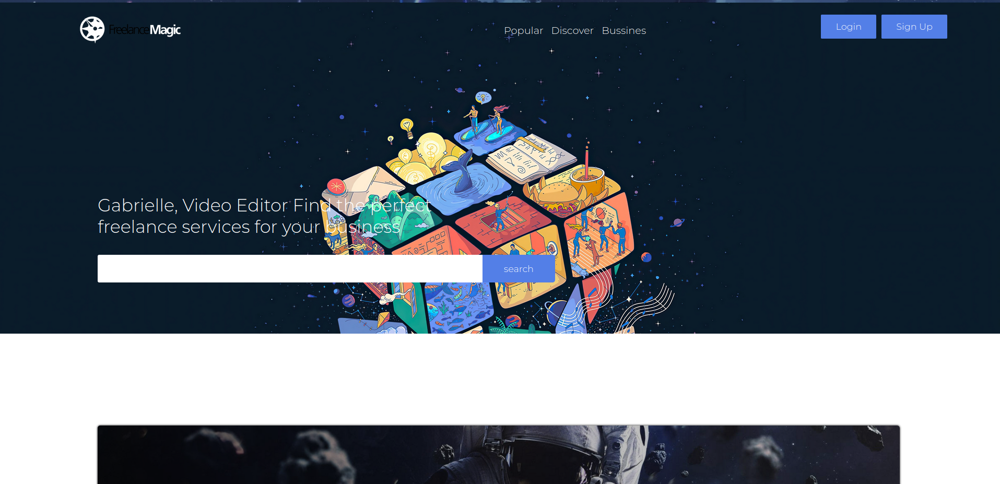
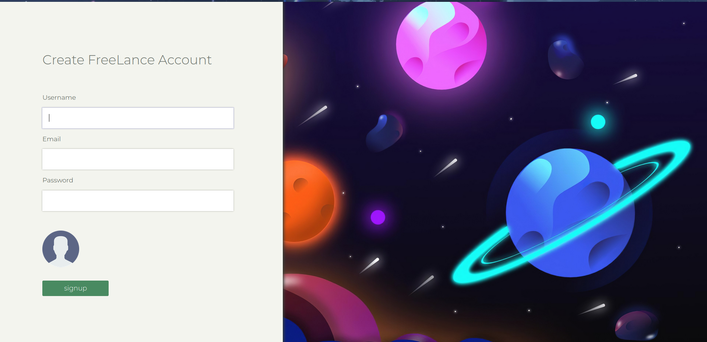
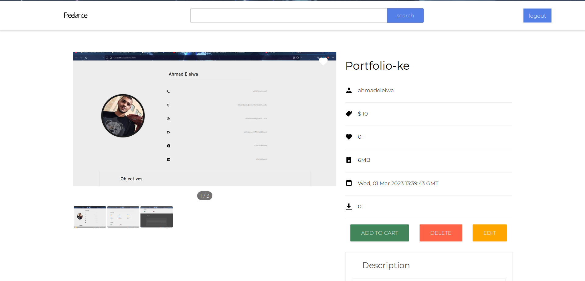

# Freelance

Freelancing is a free-space hosting website built using MERN stack. The site allows you to upload your projects (products) in the site. You can also access the other users products. You can put like to them or buy it. Aslo, the site has an authentication system.

I used MERN stack in this project because the flexibility of js  and the power of Node.js. With react it is easy to build an interactive website.

The most problem that faced me is that during  authentication. It has to check whatever the email exists or not. So, I had to use google API to send a code to the email that was inserted. Then after that, the front-end app has to wait until insert the generated code that was sent.

## How To Run

First of all you need to install node.js. After installing node.js, you have to run the server app and client app as individuals by using npm start. After running the project, the app should be like as shown below.
```bash
npm start
```



## Authentication

The sign up and the login pages are in the same file. That's mean it's easy to switch between them without lost of data.

### Sign up page



### When the user is already exist

If the user already exists, it immediately disables the submit button


## Preview of product

All products must have title, description, createdDate, author, genres(tags) and price. Only the owner of this product can Delete & Edit it. The others won't show them the delete & edit buttons. 


## What Services are provided ?

### Provided Services

* Authentication system
 
* Email validator 
 
* Product manpluation  system
 
* Preview product page
 
* Search system
 
* No SQL Database 
 
* Working on API

### Future Features

* Dashboard 
 
* User manpluation system

* Working on advance search


